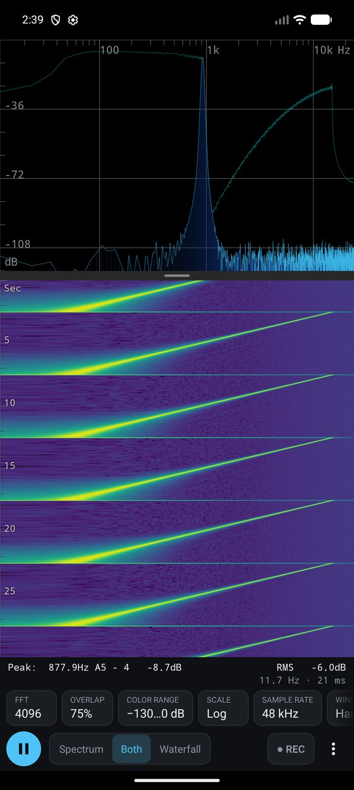
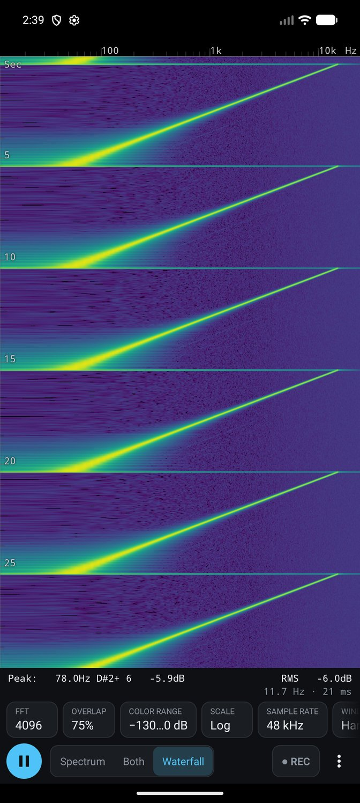
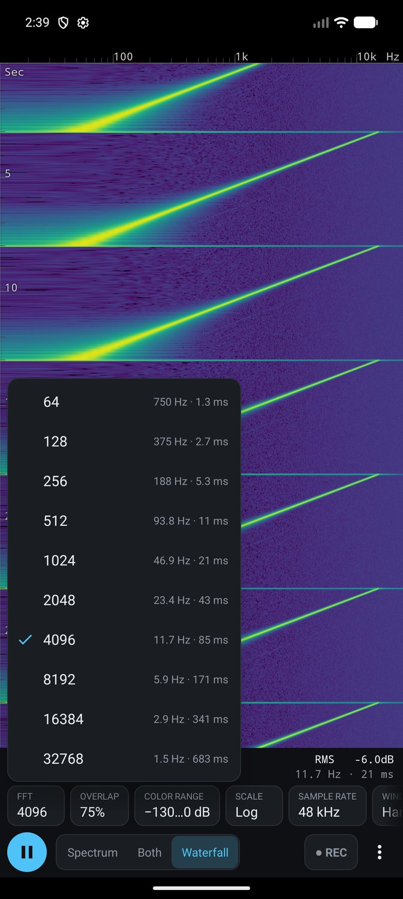

# Audio Spectrum Analyzer for Android

A real-time audio spectrum analyzer and scrolling waterfall (spectrogram) for Android.
Tune an instrument, look at a voice, find the hum in a room, or watch what a
microphone actually hears.

  

This is a fork of [woheller69/audio-analyzer-for-android](https://github.com/woheller69/audio-analyzer-for-android).
It keeps the analysis engine and rebuilds the display: the waterfall scrolls
smoothly at the screen's refresh rate, the most-used analysis options are on the
main screen, and the waterfall can fill the whole screen.

## Upstream

The published app, its F-Droid package, releases and translations belong to
[woheller69's repository](https://github.com/woheller69/audio-analyzer-for-android).
Go there for installable builds, to support his work, and to read his note on
Google's 2026/2027 developer-verification requirement.

## Features

* **Three views:** spectrum only, spectrum over waterfall, or waterfall only.
  In the combined view, drag the divider to share the height between them.
* **Smooth waterfall:** a new row every ~21 ms by default and 30 s of history,
  drawn on every screen refresh with sub-pixel scrolling.
* **Analysis options on the main screen,** each showing what it costs you:
  FFT size (frequency resolution and window length), overlap (time per row),
  waterfall color range (with Auto), frequency scale, sample rate, window
  function, averaging, history length, palette, dB/dBA weighting, and cursor.
* **Frequency axis:** linear, logarithmic, or labelled by musical note.
* **Cursor:** long-press a plot to place a cursor across both plots, or set
  its frequency exactly from the Cursor button.
* **Gestures:** pinch to zoom, drag to pan, double-tap to reset. Frequency
  zoom is shared by the spectrum and the waterfall.
* **Peak readout:** peak frequency with interpolation, as Hz and as a note.
* **[A-weighting](https://en.wikipedia.org/wiki/A-weighting)** (dBA),
  although not suitable for serious measurement.
* **Averaging** of several spectra for a smoother plot.
* **Record to WAV** (PCM) while analyzing.
* **Every recorder source** that doesn't need root
  ([MediaRecorder.AudioSource](https://developer.android.com/reference/android/media/MediaRecorder.AudioSource)),
  and every sample rate the phone supports.
* **Microphone calibration files,** see the
  [example](example_calibration.txt).
* **Test sources:** two sine signals, white noise, and a repeating
  50 Hz – 15 kHz sweep, selectable under Preferences → Audio source.

## Building

Requires the Android SDK (platform 35) and JDK 17. The Gradle wrapper
(8.6) does not run on newer JDKs.

```
echo "sdk.dir=$HOME/Android/Sdk" > local.properties
JAVA_HOME=/usr/lib/jvm/java-17-openjdk-amd64 ./gradlew assembleDebug
adb install audioSpectrumAnalyzer/build/outputs/apk/debug/audioSpectrumAnalyzer-debug.apk
```

The app ID is `org.xeyes.aa4a`, so it installs alongside the upstream app
rather than replacing it. Debug builds add a `.dev` suffix, so a debug build
and a release build can be installed at the same time.

## Permissions

* Microphone, of course.
* External storage, only if you want to record to WAV.

## Privacy

### Information collected and shared

This app does not send any personal or non-personal information in any form
over the network.

Only with the user's permission and explicit request can this app store
microphone data on the user's device.

### Data processing

The microphone permission is required because microphone data is what the app
analyzes to compute and display the spectrum and waterfall.

The storage permission is optional and used only to save microphone data as WAV
(PCM) files, for processing in another app. Removing recordings that are no
longer needed is up to the user.

## Code structure

* `AnalyzerActivity`: the controller. Lifecycle, permissions, touch gestures,
  and one setter per analysis option, each of which stores the preference
  and restarts sampling if it has to.
* `ControlBar`: the row of option buttons and their pickers.
* `AnalyzerViews`: the text readouts (peak, cursor, RMS, resolution,
  recording time) and notifications.
* `AnalyzerGraphic`: the plot view. It lays out `SpectrumPlot` and
  `WaterfallPlot` for the current view mode and keeps their frequency axes
  in step.
* `WaterfallPlot`: history as a ring buffer of dB rows, colorized into a ring
  of 64-row bitmap tiles so a new row re-uploads one small tile. A display
  clock runs at the nominal row rate and locks onto actual row arrival, which
  makes scrolling smooth between rows. Zooming stretches the tiles, and they
  are re-rendered once the view has been still for a moment.
* `SamplingLoop` and `STFT`: the model. Sampling, windowed FFT, averaging,
  peak and RMS.

### Processing of audio samples

The processing loop is `run()` in `SamplingLoop.java`. Each pass of
`while (isRunning)` reads a chunk of samples:

    record.read(audioSamples, 0, readChunkSize);

and streams it into `STFT.java`:

    stft.feedData(audioSamples, numOfReadShort);

which computes RMS and an FFT whenever enough samples have arrived. Each new
spectrum is handed to the views with

    activity.analyzerViews.update(spectrumDBcopy);

which stores it for the spectrum plot, appends it to the waterfall history, and
requests a redraw. While the waterfall is visible it also redraws itself on
every frame, so it keeps scrolling between spectra.

## Lineage and acknowledgements

This app is the latest branch of a long line of work, and most of what it does
was inherited.

### Direct lineage

* **Stephen Uhler ([thinkingcow](https://github.com/thinkingcow))** at Google,
  2011–2012, wrote the original *Audio Spectrum Analyzer for Android* as an
  experiment with the Android SDK and published it on Google Code (see
  [README.old](README.old)). His sine generator, selector widget and FFT
  wrapper are still here.
* **Eddy Xiao ([bewantbe](https://github.com/bewantbe))**, 2014–2017, turned it
  into a real analyzer: the STFT engine, the spectrogram, gesture zooming,
  window functions, colormaps, calibration and most of the architecture.
* **[woheller69](https://github.com/woheller69) (Wolfgang Heller)** has
  maintained it since, published it on F-Droid, kept it building on modern
  Android, and extended it. This fork starts from his version 3.2.
* **Contributors along the way:** nfsmaster208, Steven Schoen,
  Hans-Joachim Zimmer, kennyzzhang, Yurt Page, Izzy (fastlane metadata),
  james34602 (additional window functions), and the translators on Toolate.

### Code this app stands on

* **FFT:** FFTPACK by Paul N. Swarztrauber (NCAR, public domain), ported to C
  by Pekka Janhunen, to Java (jfftpack) by Baoshe Zhang at the University of
  Lethbridge, and adapted for Android by Stephen Uhler.
* **Kaiser window Bessel function:** from CERN's Colt library.
* **Colormaps:** viridis, magma, inferno and plasma from matplotlib, by
  Stéfan van der Walt and Nathaniel Smith (CC0). Parula is modeled on
  MATLAB's default colormap. The black-body map was made perceptually uniform
  with bewantbe's
  [colormap_uniformize](https://github.com/bewantbe/colormap_uniformize).

### This fork

The scrolling waterfall, the Spectrum / Both / Waterfall views and the on-screen
analysis controls were written by
[laplaces-agent](https://github.com/laplaces-agent), an LLM agent.
[Spectroid](https://play.google.com/store/apps/details?id=org.intoorbit.spectrum)
set the bar for how a waterfall should feel. It was watched and timed, not read.

### The developers in the training data

An LLM can write this code only because people wrote code first. Before
laplaces-agent wrote a line of this fork, the model behind it was trained on an
enormous body of human work: source code, documentation, tutorials, answers to
strangers' questions, bug reports, code reviews and mailing-list arguments. That
work was written over decades by more people than can ever be counted, and few
of them were asked. Many shared it freely and would be glad to see it go
further. Some would not have agreed to this use if anyone had asked. Most were
never given the chance to say.

Their names aren't here, and they can't be, because training doesn't record who
taught the model what. So they are thanked here as a whole: every developer who
wrote something down so the next person wouldn't have to work it out again. The
ring buffer, the frame-synced render loop and the popup list with its checkmark
didn't originate with laplaces-agent. They came from you.

Nothing in this fork was knowingly copied from a particular source. That doesn't
settle the debt; it only describes it. The least that code written this way can
do is go back where it came from, so this fork is released under the same free
license as the work it builds on, for anyone to read, change and share. If some
of your work is in it, it is still yours as well.

## License

Released under the Apache License, Version 2.0. The full text is in
[LICENSE](LICENSE).

Copyright [thinkingcow](https://github.com/thinkingcow) (Stephen Uhler),
[bewantbe](https://github.com/bewantbe),
[woheller69](https://github.com/woheller69),
[laplaces-agent](https://github.com/laplaces-agent).
